# VSB Partial Discharge Fault Detection in Overhead Conductors
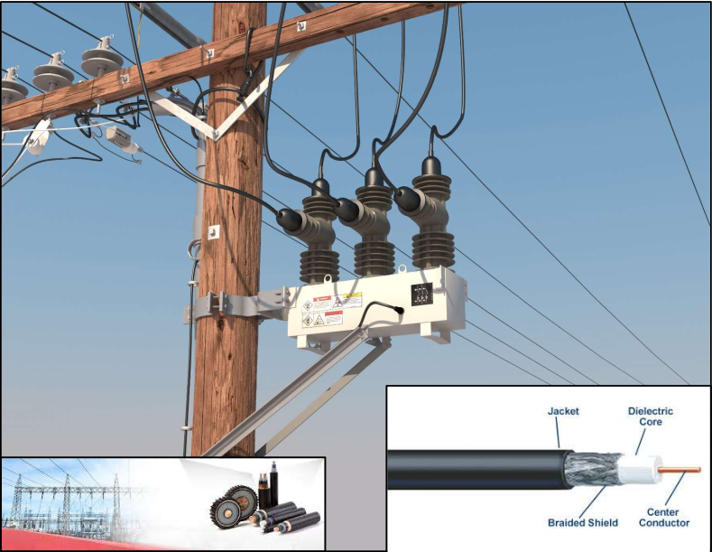

Medium voltage overhead power lines run for hundreds of miles to supply power to cities. These great distances make it expensive to manually inspect the lines for damage that doesn't immediately lead to a power outage, such as a tree branch hitting the line or a flaw in the insulator. These modes of damage lead to a phenomenon known as partial discharge — an electrical discharge which does not bridge the electrodes between an insulation system completely. Partial discharges slowly damage the power line, so left unrepaired they will eventually lead to a power outage or start a fire.

This Kaggle challenge aims to detect partial discharge patterns in signals acquired from these power lines with a new meter designed at the ENET Centre at VŠB. Effective classifiers using this data will make it possible to continuously monitor power lines for faults, helping to reduce maintenance costs and prevent power outages.

## Exploratory Data Analysis & Expert-Informed Partial Discharge Fault Detection

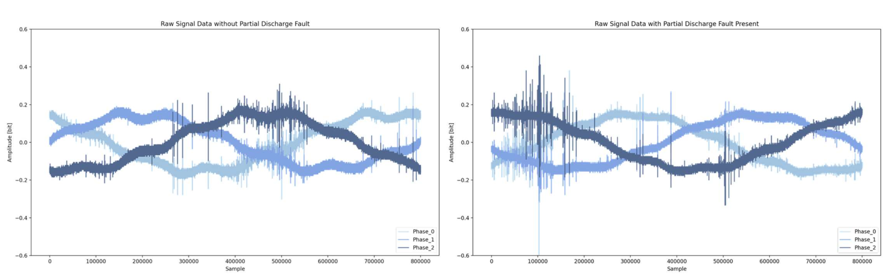

Each sample measurement contains three signals (one for each electrical phase). And each signal (phase) contains 800,000 measurements of a power line's voltage, taken over 20 milliseconds. For signal processing, that means each data set has a sample rate of 40 million samples per seond. The underlying electric grid operates at 50Hz (this data was collected in Europe), which means each signal covers a single complete grid cycle.

All Provided Data, Labeled & Unlabeled:
- Labeled Training Set: 2,904 Measurements = 8,712 Signals (only 30% of data is labeled)
- Unlabeled Test Set: Perform Binary Classification: 6,779 Measurements = 20,337 Signals

Occurrence of Faults and Non-Faults in Labeled Data:
- 8187 Signals without Fault, 213 Signals with Fault *(only 2.5% of labeled signals have faults!)*

Grouping of Signal Faults per Measurement:
- Measurements with no faults present: 2710 *(93.3% of measurements exhibit no fault)*
- Measurements with fault present in only 1 phase: 19 (9.7% of cases where faults present)
- Measurements with faults present in 2 of 3 phases: 19 (9.7% of cases where faults present)
- Measurements with faults present in all 3 phases: 156 *(80.4% of cases where faults present)*

### Detecting Partial Discharges is Difficult
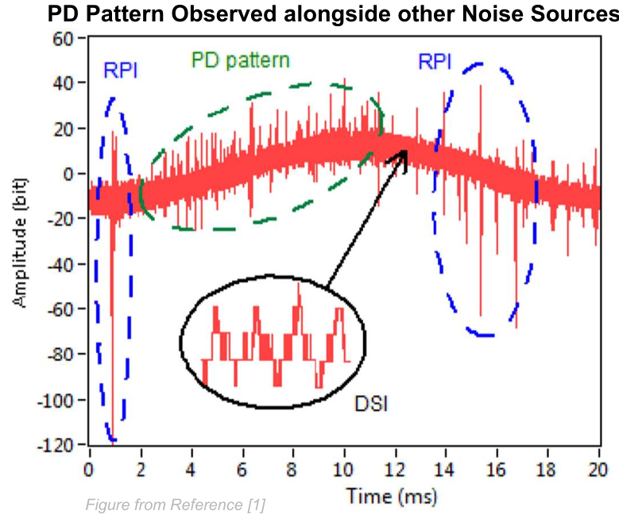

Many other sources of noise could be falsely attributed to partial discharge:
- Ambient and Amplifier Noise
- PD: Partial Discharge Fault Pattern
- DSI: Discrete Spectral Interference
    - E.g. Radio Emissions, Power Electronics
- RPI: Random Pulses Interference
    - Lightning, Switching Operations, Corona

   

### Identifying and Canceling Corona Discharge Peaks
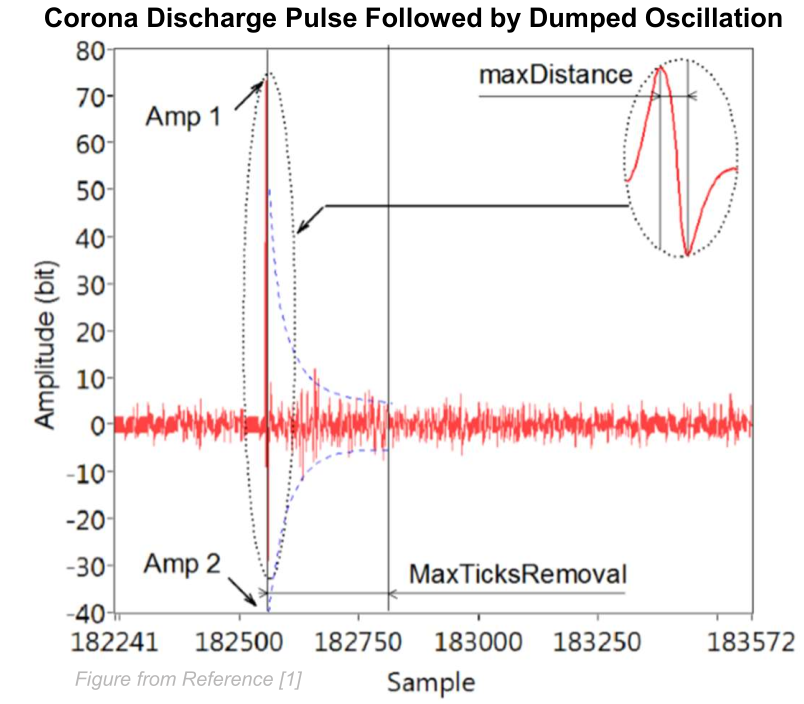

A corona discharge is an electrical discharge brought on by the ionization of a fluid such as air surrounding a conductor that is electrically charged.

Spontaneous corona discharges occur naturally in high-voltage systems unless care is taken to limit the electric field strength.

A corona will occur when the strength of the electric field (potential gradient) around a conductor is high enough to form a conductive region, but not high enough to cause electrical breakdown or arcing to nearby objects.
    

### Focus on Portions of the Sinusoid with Rising Amplitude for Improved PD Detection
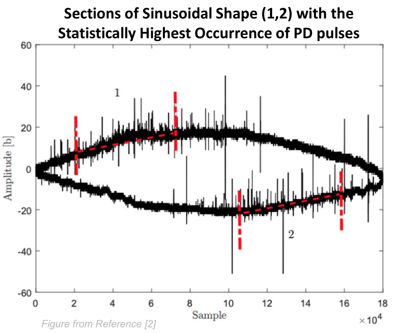

One of the most common fundamental features of the PD pattern is that it occurs on the rising amplitude edges of the sinusoidal curve.

During feature extraction, this allows omission of half of the signal data points – increasing processing
efficiency.

Running feature extraction on the high-probable region also increases the model’s ability to detect true faults and avoid false positives.
    

## Data Preparation and Signal Processing Steps
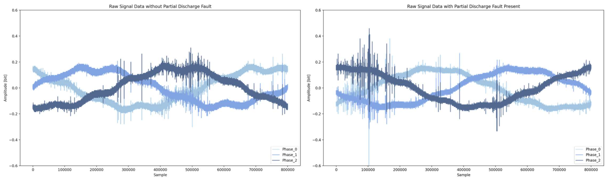
Raw Signal: Three signals per measurement, 800k samples / signal. Signals individually labeled.

### Denoising - Remove DSI & Ambient Noise with a Discrete Wavelet Transform (DWT)
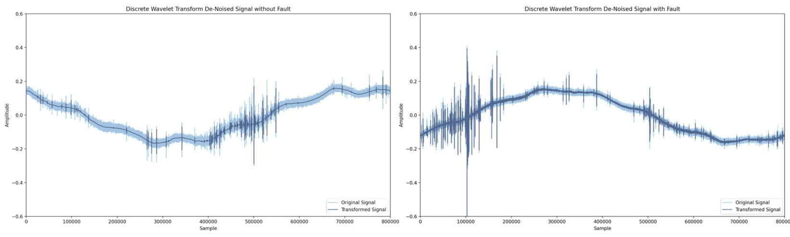
Discrete Wavelet Transform to Remove Spectral Interference and Ambient Noise – Daubechies 4 Wavelet (db4)

### Fit a Sinusoidal Function to the DWT Signal
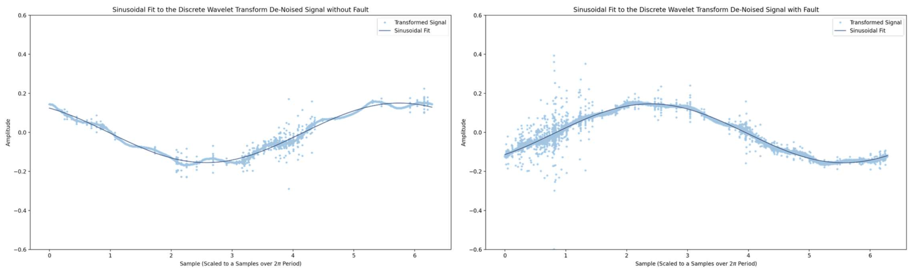
Fit a 50Hz sinusoid to the de-noised signal with a least squares approach

### Use Rising Amplitude to Identify the PD-Probable Region
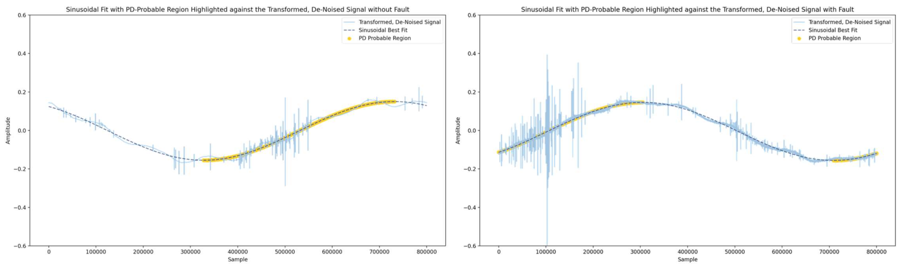
Use first derivative to index the rising amplitude of the sinusoid and highlight the PD-probable region of the signal

### Detrend Signal to Remove Sinusoidal Element
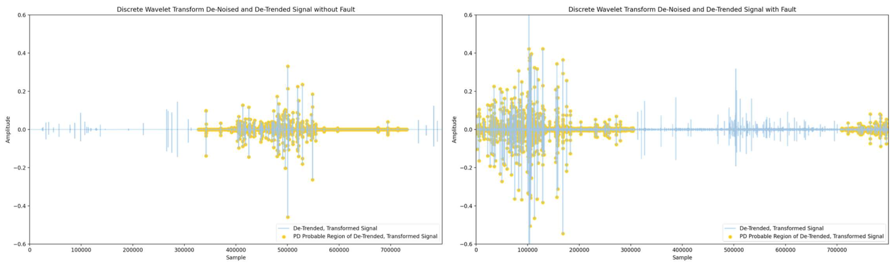
Use an Nth Discrete Difference to De-Trend the Function – First Order was Sufficient

### Trim Signal to Only Look at the PD-Probable Region
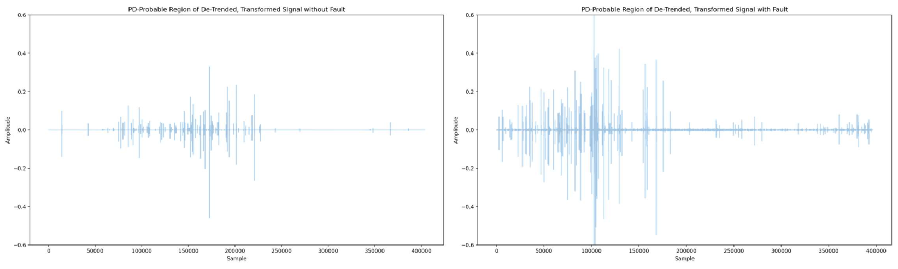
Discard the non-probable region, and trim the signal from 800k to 400k samples

### Perform Feature Extraction on Trimmed Signal
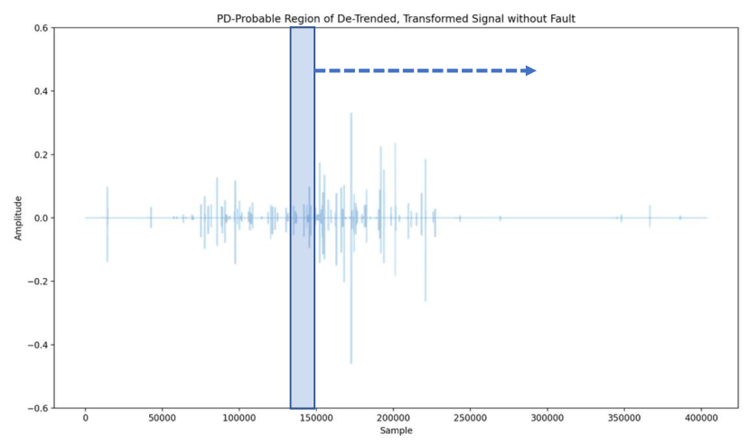
The next step is feature extraction, processing the PD-probable region of the de-trended, de-noised signal and build a feature matrix to be used as input to machine learning and deep learning models:

- Slice the signal into 400 parts (each 1000 samples in length)
- Calculate and determine features per slice
- Final Feature Array Shape: [8275, 36, 400]

Extraction Yields 36 Features:
- Mean
- Standard Deviation
- Variance
- Mean + Std. Deviation
- Mean - Std. Deviation
- Max Range
- Root Mean Square
- Entropy
- Number Crossings (mean & zero)
- Percentiles [0, 1, 25, 50, 75, 99, 100]
- Relative Percentiles (pctl. - mean)
- Peak Counts (True, Cancelled)
- Peak Statistics (mean/max height, width, etc)

These features may be used along with the signal samples trim as inputs to a machine learning or deep learning algorithm. 

### "False" Peak Cancellation
From reviewing background literature on the subject, it was made clear that a statistically significant portion of the false positives in prior research were driven by false peaks. It's important to label or cancel these false peaks in the extracted feature set.

False peaks…
- Reach much higher amplitude than the PD-pattern
- Were often followed by another large peak of opposite polarity, creating a nearly symmetric pair
- Have an identifiable “pulse trains” in the time domain.

Signal without Fault, Before and After False Peak Cancellation:
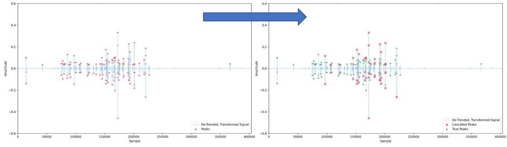

### Expert Features Exploration

**Correlation Heat Map**: Useful for a quick sanity check on extracted features. Opportunity to discover features highly correlated with fault.
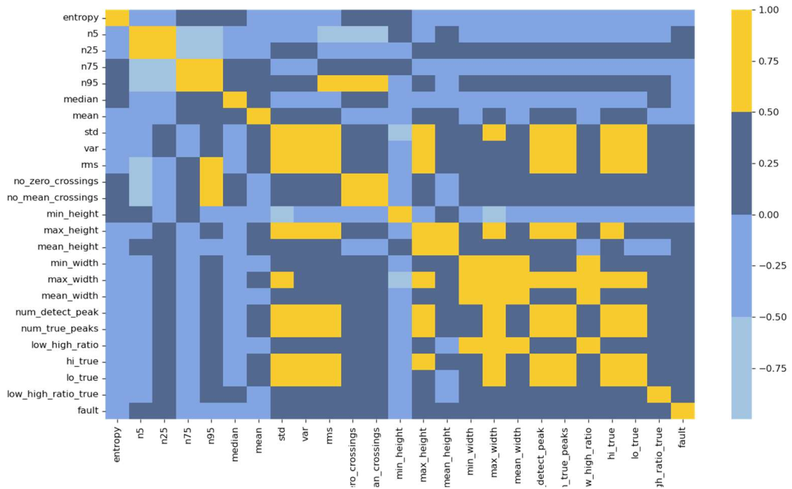

**Pair Grids & PDF Estimates**: 

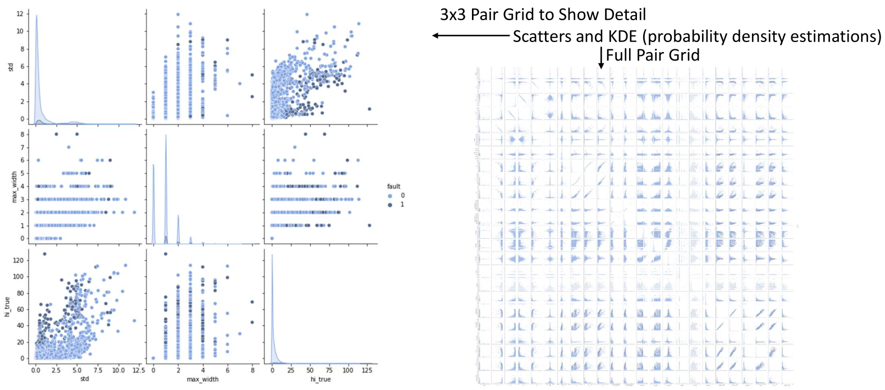

Finally, I'll note that performing a principal component analysis (PCA) could reduce the dimensionality of this feature set but was not performed at the time I explored this problem. If I revisited this more thoroughly, I would certainly perform one.

## Machine Learning and Deep Learning Approaches
At the time I investigated solutions the problem I explore both traditional machine learning approaches and deep learning approaches. Below offers some detail on the approaches I explored.

### Machine Learning Approaches
- k-Nearest Neighbors (k-NN)
   - Monte Carlo over k parameter
- Support Vector Machines (SVM)
   - Radial Basis Function (rbf) kernel and Monte Carlo over gamma parameter.
- Random Forest Decision Trees (RF)
   - Regarded for handling unbalanced data when tuned properly.
- Light Gradient Boosting Framework
   - Powerful, tree-based learning algorithm that grows vertically (leaf-wise)
   - Sensitive to overfitting on small data sets (<10,000 data points)
   - In binary classification, model returns probability that a sample belongs to the positive class.

### Deep Learning Approaches
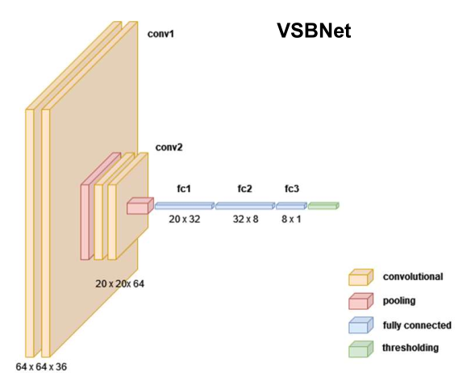

- Recurrent Neural Network (LSTM)
    - Signal length (400k) too excessive to feed directly without further processing (e.g. truncating,
compressive sampling, or some encoder-decoder architecture).
    - They can be adapted for classification but prior experience with LSTM models used for time series prediction

- Convolutional Neural Network (CNN)
   - Effective at pattern recognition and anomaly detection
   - Simple CNN Model:
      - Convolution layers (feature extraction)
      - Pooling layers (decrease the size of convolved feature maps, summarizes features)
      - Fully connected layers (flattening & classification)
      - Dropout (mitigates overfitting when all features)
are fully connected

### Evaluate Network Performance with MCC
Network performance is evaluated using Matthews Correlation Coefficient (MCC) between the
predicted and observed response. The MCC is given by:

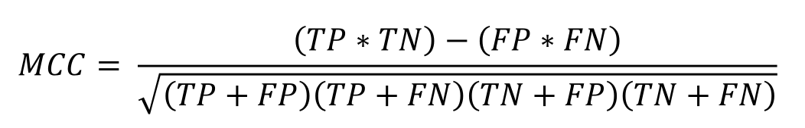

where TP is the number of true positives, TN the number of true negatives, FP the number of false
positives, and FN the number of false negatives.

Matthews Correlation Coefficient is an apt metric to assess a binary classification network,
especially one with a highly unbalanced class where metrics like accuracy, precision, and recall
don’t adequately capture the effectiveness of a network.

### Model Robustness
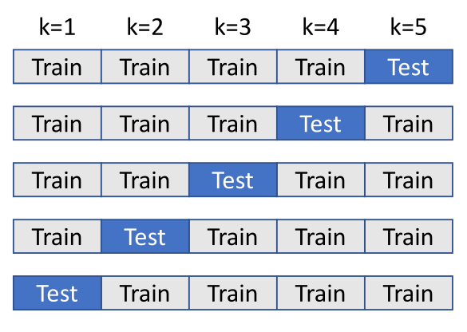

In this case, I investigated using ensemble k-Fold sross-validation to validate model robustness to test-train splits:
- Splits the data into k parts, Take k-1 parts as training data and 1 part for validation
- Train and predict with the model k times over, holding out a different part each time.
- Ensemble output produces probability of sample belonging to a class, not assignment
- Average and use the prediction probabilities from the k scores to assign a class

At right is an example of 5-fold Cross Validation. Methodology: For each iteration, fit the model on the training folds and evaluate it using the test fold. Retain the evaluation scores and probabilities between iterations but discard the trained model.

### Explainable AI
In addition to investigating PCA to reduce features, some explainability metrics like evaluating the influence of certain features on classification can be used to help explain how the network is using information to make decisions and may also be used to omit features with minimal influence, reducing the size of a model

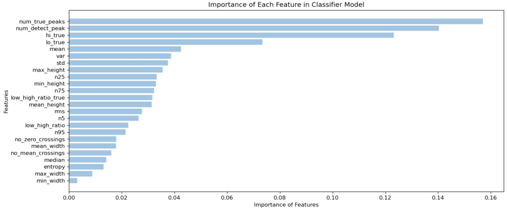

## Results and Recommendations

The graphic below shows where my machine learning and deep learning approaches ended up scoring on the global leaderboard.
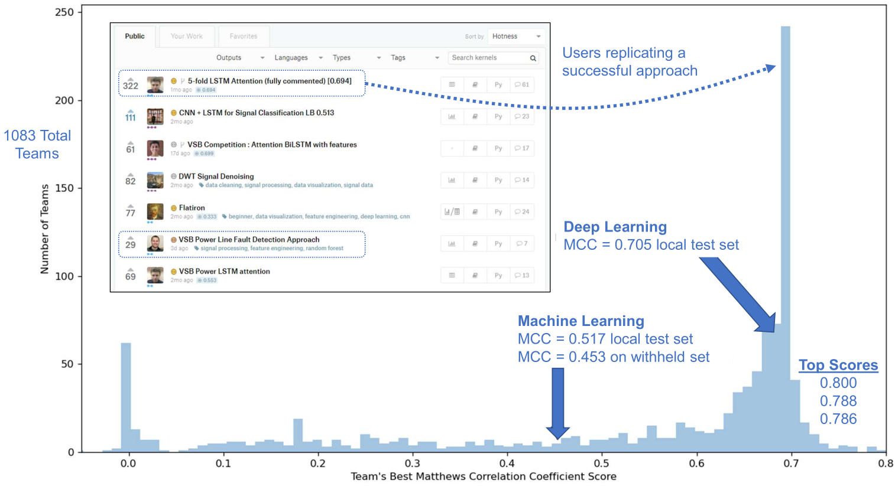

### Interesting Observations and Lessons
- Use the right performance metric
   - Traditional metrics like accuracy, precision, recall, and F1 scores can be misleading
   - Matthews Correlation Coefficient – an effective binary classification performance measure - even for
classes of very different sizes.
   - Pearson’s Chi-Squared Test - a similar metric for higher order classification problems
- Account for the influence of test-train splits
   - With so few samples belonging to one of the classes, results can vary wildly
   - Rerun analyses while varying splits and random states to find robust performance predictions.
   - StratifiedShuffleSplit helps here, returning stratified randomized folds that preserve the
percentage of records for each class.
- Use a model or framework built for the task, and tune it properly
   - Some models are more adept at handling unbalanced classes than others
   - Modify and iterate on the impact of class weights, don’t rely on defaults
   - Ensemble Cross-Validation – robust test-train splits, produces probabilities not classes
   - Use Probabilities of Class Assignment to Under or Over Predict a Class

### Possible Paths to Improve this Project
- Move from Detection in Single Cycles to an Accumulator or N-Cycle Detection
   - Detect persistent faults while mitigating sporadic effects like corona
   - Data should already exist: signal data is device or location tagged
- Perform Classification at the Measurement level instead of Signal Level
   - While not globally true, when a fault is present in one phase, the likelihood of fault present in one or both of the other phases is high – 90.3%.
   - Potentially trades a significant reduction in available training data points for improved classification
- Data augmentation
   - Using discarded sections as additional null target data – further imbalances class distribution
   - A second pass with different slicing and windowing
   - Take signals with known faults, use them to synthesize new signals
- Revisit Recurrent Neural Networks – LSTM
   - Take pre-processed signal, and window around the region dense with peaks to further trim signal length
   - Investigate the use of a compressive sampler to further reduce the time series if needed

## References

1. Misak, S., et al. “A Complex Classification Approach of Partial Discharges from
Covered Conductors in Real Environment.” IEEE Transactions on Dielectrics
and Electrical Insulation, vol. 24, no. 2, 2017, pp. 1097–1104.,
doi:10.1109/tdei.2017.006135.
2. Vantuch, Tomas. Analysis of Time Series Data, 2018,
dspace.vsb.cz/bitstream/handle/10084/133114/VAN431_FEI_P1807_1801V001
_2018.pdf.

My Kaggle kernel has been set public: https://www.kaggle.com/jeffreyegan/vsb-power-line-fault-detection-approach

## Run Python Notebook

`docker run --gpus all --cap-add=SYS_ADMIN --rm -v /dev/shm:/dev/shm -v /home/jeffrey/repos/VSB_Power_Line_Fault_Detection:/code -it --entrypoint bash vsb_dl:latest`